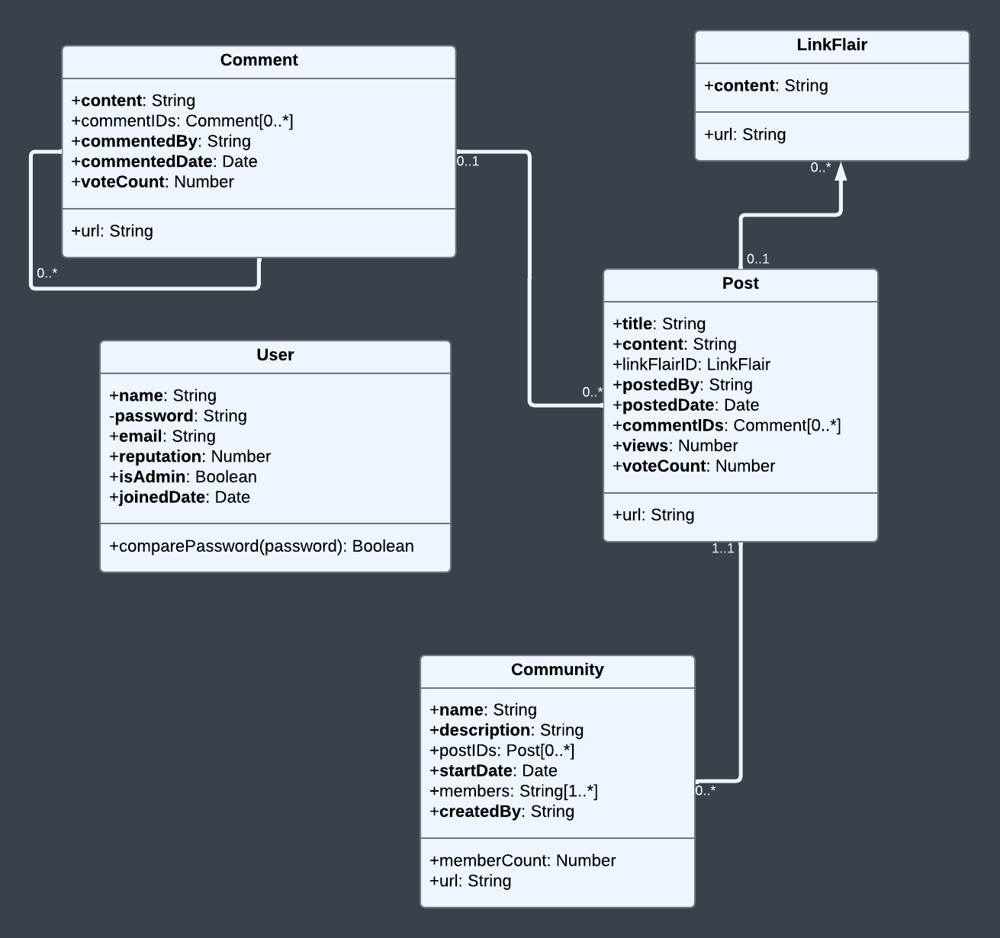

[](https://classroom.github.com/a/MVUO33FO)
# Term Project

Database Structure:


Client Structure:


Server Structure:


## Initial Setup Instructions
#### (Only tested on Windows, assuming that Node and MongoDB are already installed on the PC)

Start by opening a terminal in the base project directory.

Copy and paste the following command into the terminal:
```sh
cd client;npm install;cd ../server;npm install;
```
> [!IMPORTANT]
> If you did not install MongoDB as a service, open a new terminal and run this command:
> ```sh
> mongod
> ```
> This starts MongoDB and allows the site's files to connect to the database. Do not close this terminal until you've finished using the site.

Now, enter these commands one-by-one:
```sh
mongosh "mongodb://127.0.0.1:27017"
use phreddit;
db.createCollection("phreddit");
exit
```
> [!TIP]
> These commands ensure that the initialization script will be able to access the database.

After that finishes, run init.js in Terminal 1 with the following syntax:
```sh
node init.js mongodb://127.0.0.1:27017/phreddit <ADMINNAME> <ADMINEMAIL> <ADMINPASSWORD>
```
> [!TIP]
> Here's an example that initializes the admin account to have username `admin`, email `admin@phreddit.com`, and password `adminPW`: 
> ```sh
> node init.js mongodb://127.0.0.1:27017/phreddit admin admin@phreddit.com adminPW
> ```

Now you can run the following command to launch the server on port 8000:
```sh
node server.js
```

Finally, open a new terminal in the base project directory, and run this command to launch the React app:
```sh
cd client;npm start
```

## Starting the Website Again
After the initial setup, if you close all the terminals and then want to start it up again, follow these steps:

> [!IMPORTANT]
> If you did not install MongoDB as a service, open a terminal and run this command:
> ```sh
> mongod
> ```
> This starts MongoDB and allows the site's files to connect to the database. Do not close this terminal until you've finished using the site.

Open a new terminal in the base project directory and run:
```sh
node server/server.js
```

Open another terminal in the base project directory and run:
```sh
cd client;npm start
```

## Running the Jest Tests
> [!WARNING] 
> server.js (and mongod, if necessary), must be running for all tests to pass! If no terminals are open, follow the steps in the previous sections.

In a new terminal in the base project directory, enter the following command to run the two server unit tests:
```sh
cd server;npm test;cd ..
```
Enter the following command in the base project directory to run the client unit test:
```sh
cd client;npm test;cd ..
```


## Team Member Contributions
### Martin You
- Full Frontend (All changes to React code since HW3)
### Dylan Nicastro
- Backend changes + Documentation + Unit Tests